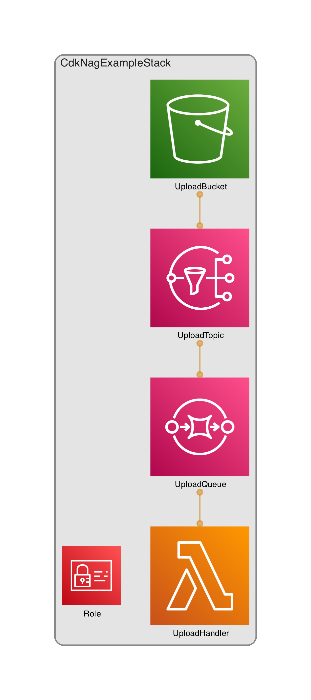

# cdk-nag example

This project is an example how to use [cdk-nag](https://github.com/cdklabs/cdk-nag).
It provisions a sample application  which consists of
- a publicly accessible S3 bucket which
- publishes it's `OBJECT_CREATED` events to a SNS topic
- a SQS Queue that subscribes to that topic
- a lambda function that consumes these events from the Queue

The brances in this project reflect the different stages we use to apply cdk-nag to this stack:
1. introducing the checks
2. remediate the errors
3. supress other errors
4. test that the stack complies to the rule set
5. adapt the tests

see also https://docs.google.com/presentation/d/1mayJ2jRn0VSWSCrSt4fk87uX16RhKQqV8BemTZVXAc0

